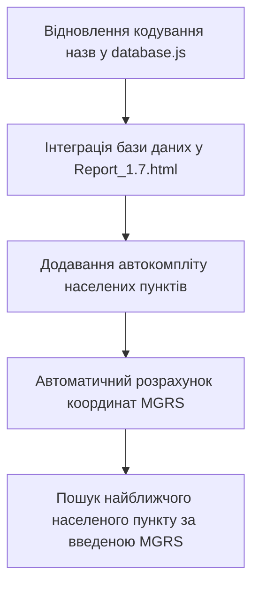

# Аналіз файлів проєкту «Подання БПЛА»

Цей звіт містить детальний аналіз структури проєкту, опис кожного файлу, виявлені проблеми та рекомендації щодо подальшого розвитку застосунку.

---

## 📂 Структура проєкту

Проєкт складається з 5 основних файлів у кореневій директорії:

1. **[Report_1.7.html](file:///c:/Users/useR/Мій%20диськ/1%20Projects/Подання%20БПЛА/Report_1.7.html)** — веб-інтерфейс генератора звітів.
2. **[Запит збору локацій.txt](file:///c:/Users/useR/Мій%20диськ/1%20Projects/Подання%20БПЛА/Запит%20збору%20локацій.txt)** — Overpass Turbo запит для вивантаження геоданих.
3. **[database.json](file:///c:/Users/useR/Мій%20диськ/1%20Projects/Подання%20БПЛА/database.json)** — база даних населених пунктів (JSON).
4. **[database.js](file:///c:/Users/useR/Мій%20диськ/1%20Projects/Подання%20БПЛА/database.js)** — база даних населених пунктів (як JS-модуль/змінна).
5. **[mgrs.js](file:///c:/Users/useR/Мій%20диськ/1%20Projects/Подання%20БПЛА/mgrs.js)** — бібліотека для роботи з координатною сіткою MGRS.

---

## 🔍 Детальний опис компонентів

### 1. Генератор звітів (`Report_1.7.html`)
* **Призначення:** Веб-додаток (HTML+CSS+JS) для швидкого формування офіційних повідомлень про втрату безпілотних літальних апаратів (БпЛА) особовим складом РР 95 одшбр.
* **Функціонал:**
  * Вибір дати та часу (власні кастомні календарі та пікери часу).
  * Вибір типу місії, причини втрати, моделі БпЛА (Mavic 3, Matrice 4, Autel EVO Max, FlyEye 3.0), серійного номера, одиниць виміру та типу АКБ.
  * Валідація координат MGRS за регулярним виразом.
  * Формування фінального тексту повідомлення відповідно до військових стандартів.
  * Підтримка світлої/темної тем (з автоматичним визначенням системної теми).

### 2. База даних локацій (`database.json` & `database.js`)
* **Призначення:** Зберігання координат (широта/довгота), назв та областей населених пунктів східних та південних регіонів України (Донецька, Дніпропетровська, Луганська, Харківська, Запорізька, Сумська області).
* **Структура запису:**
  ```json
  [
    47.0957648,
    37.5499621,
    "Маріуполь",
    "Донецької області"
  ]
  ```
  *(Широта, Довгота, Назва населеного пункту, Область)*.

### 3. Скрипт Overpass Turbo (`Запит збору локацій.txt`)
* **Призначення:** Текстовий файл із запитом Overpass QL для сервісу [Overpass Turbo](https://overpass-turbo.eu/).
* **Опис:** Запит збирає точки (`node`) з типом `place` (city, town, village, hamlet) у межах шести вказаних областей України і повертає їх у форматі CSV (координати, назва, область). Результати цього запиту, ймовірно, стали основою для `database.json`.

### 4. Конвертер координат (`mgrs.js`)
* **Призначення:** Бібліотека для перетворення координат між стандартною географічною системою (WGS84 Latitude/Longitude) та військовою системою сітки **MGRS** (Military Grid Reference System).

---

## ⚠️ Виявлені проблеми та критичні баги

### 1. Пошкодження кодування назв (Mojibake) у базі даних
У файлах `database.json` та `database.js` назви населених пунктів збережені у пошкодженому кодуванні (UTF-8 байти інтерпретовані як Windows-1252 / ISO-8859-1).
* **Приклад:** `"Маріуполь"` замість `"Маріуполь"`, `"Донецьк"` замість `"Донецьк"`.
* **Причина:** Під час імпорту чи збереження результатів Overpass Turbo виникла помилка декодування текстового потоку.
* **Чому це важливо:** У такому вигляді базу даних неможливо використовувати для пошуку або автозаповнення у веб-інтерфейсі.
* **Шлях вирішення:** Потрібно запустити скрипт відновлення кодування, який конвертує ці символи назад у коректний UTF-8.

### 2. Відсутність інтеграції компонентів (Абстракція)
Хоча в проєкті присутні `database.js` та `mgrs.js`, файл `Report_1.7.html` наразі **ніяк їх не використовує**:
* Користувач змушений вручну вводити назву населеного пункту та область.
* Користувач змушений вручну вводити координати MGRS.
* Немає перевірки відповідності введеної MGRS-координати та обраного населеного пункту.

---

## 💡 Рекомендації та план покращення проєкту

Для перетворення проєкту на повноцінний premium-інструмент пропонуються такі кроки:



### Крок 1. Виправлення бази даних (`database.js` / `database.json`)
Написати скрипт, який пройде по всіх записах та перекодує Mojibake. Наприклад, логіка відновлення на JS:
```javascript
function decodeMojibake(str) {
  const bytes = new Uint8Array(str.length);
  const cp1252Map = {
    0x20AC: 0x80, 0x201A: 0x82, 0x0192: 0x83, 0x201E: 0x84, 0x2026: 0x85, 0x2020: 0x86, 0x2021: 0x87,
    0x02C6: 0x88, 0x2030: 0x89, 0x0160: 0x8A, 0x2039: 0x8B, 0x0152: 0x8C, 0x017D: 0x8E,
    0x2018: 0x91, 0x2019: 0x92, 0x201C: 0x93, 0x201D: 0x94, 0x2022: 0x95, 0x2013: 0x96, 0x2014: 0x97,
    0x02DC: 0x98, 0x2122: 0x99, 0x0161: 0x9A, 0x203A: 0x9B, 0x0153: 0x9C, 0x017E: 0x9E, 0x0178: 0x9F
  };
  for (let i = 0; i < str.length; i++) {
    const code = str.charCodeAt(i);
    bytes[i] = cp1252Map[code] !== undefined ? cp1252Map[code] : code;
  }
  return new TextDecoder('utf-8').decode(bytes);
}
```

### Крок 2. Інтеграція бази даних та автозаповнення (Autocomplete)
* Підключити `<script src="database.js"></script>` та `<script src="mgrs.js"></script>` до `Report_1.7.html`.
* Додати випадне меню (dropdown) або список пропозицій (`datalist`) для поля "Населений пункт".
* Коли користувач обирає місто/село із бази, автоматично:
  1. Отримувати його географічні координати (lat, lon).
  2. Перетворювати їх в MGRS-координату за допомогою `mgrs.forward([lon, lat], 5)`.
  3. Підставляти сформовану MGRS-координату в поле введення.

### Крок 3. Реверсний пошук найближчої локації
* Якщо військовий знає лише координату (наприклад, зняту з пульта БпЛА чи карти), він вводить MGRS-координату в поле.
* Додаток конвертує MGRS в Lat/Lon: `const coords = mgrs.toPoint(mgrsStr)`.
* Програма шукає в `myData.elements` найближчий населений пункт (за формулою відстані або спрощеною теоремою Піфагора) і автоматично заповнює назву населеного пункту та область.
* Додатково розраховувати відстань та напрямок від населеного пункту (наприклад: *«2.5 км на північний схід від н.п. РОБОТИНЕ»*), що зробить подання значно точнішим та зекономить час на ручне вимірювання.
